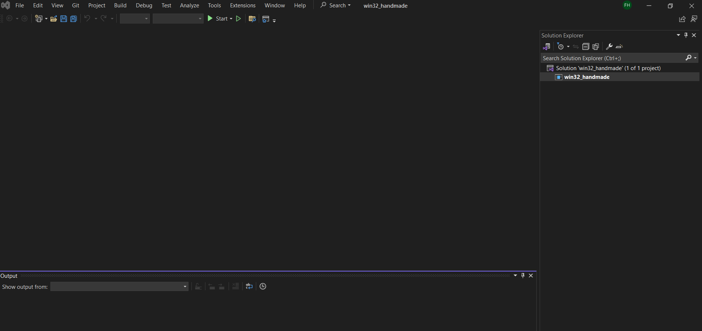

# Handmadehero game development

## How to build
First run init_shell.bat to enable cl 
Then from code dir, run build.bat

## How to run
To run in visual studio go to build directory and type 
> devenv win32_handmade.exe 

This opens up visual studio and below screen will be shown 

Right click on win32_handmade and click on properties. In the window opened, set Working directory to C:\Development\Projects\handmade\data 
Then press F5 to run, or F11 start stepping through.

## Stuff related to win api
Data types are defined [here](https://learn.microsoft.com/en-us/windows/win32/winprog/windows-data-types) 
RegisterClass [here](https://learn.microsoft.com/en-us/previous-versions/ms961353(v=msdn.10)) 
WNDCLASS [here](https://learn.microsoft.com/en-us/windows/win32/api/winuser/ns-winuser-wndclassa) 
MainWindowCallback signature [here](https://learn.microsoft.com/en-us/windows/win32/api/winuser/nc-winuser-wndproc) 
CreateWindowEx [here](https://learn.microsoft.com/en-us/windows/win32/api/winuser/nf-winuser-createwindowexa) 

## Learnings
### Static keywork
<ol>
    <li>When a variable is declared static inside a function, its initialized only once and its value persists between function calls
     until we update it.</li>
    <li>When a global variable is declared static, its initialized to 0 by default.</li>
    <li>When a function is declared static, it scope is only contained within that translation unit. Other translation units won't be able to access it.</li>
</ol>